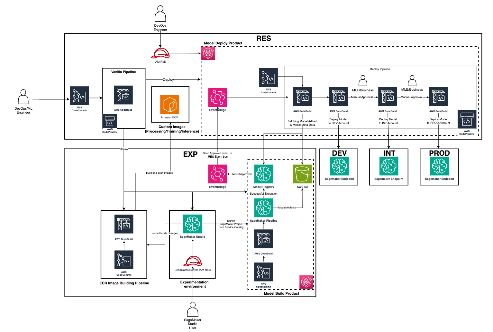
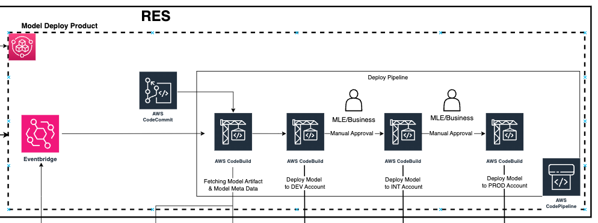
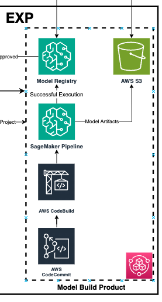

# Harvesting MLOps v1.4.3

This project is based on the [Vanilla Pipeline v1.2.5](README_VANILLA_PIPELINE.md) with addition of CDK Stacks for MLOps deployments. For documentation and setup instruction of the Vanilla Pipeline v1.2.5.
Configure all required ENV vars according to [ENV_VARS.md](ENV_VARS.md).

## Solution Architecture
On a service level, we are deploying the following resources:



## Deployment Stages
The solution is deployed over four different stages. We differentiate:
<br><br>

## RES Stage
Defined in `lib/cdk-pipeline/app/ResStage.ts`: Deployment into the RES account. <br>
Describes the deployment of all resources, that are shared across different accounts, such as the ModelDeploy ServiceCatalog Product and the ECR repositories for our custom images.

## ModelDeployServiceCatalogStack
Deploys a Service Catalog Product for the ModelDeploymentPipeline for cross account Model Deployment into the staging environments (DEV/INT/PROD).

## Architecture


## Product Deployment
ServiceCatalogStack creates a ServiceCatalog Portfolio for us to add Service Catalog Products.
To deploy a Service Catalog Product for the ModelDeploymentPipeline, we add a Service Catalog Product to the Service Catalog Portfolio.
Once the ModelBuilding Product is launched in the EXP account, users can go to Service Catalog in the RES account and launch a ModelDeploymentPipeline to deploy the model created by the ModelBuilding Pipeline in EXP. For this, users need to reference the name of the ModelPackageGroup, that the ModelBuildPipeline creates.

The product deploys:
- A CodeCommit Repository containing a seed code located in `src/sagemaker/seed-code/model-deployment`
- EventBridge rule, matching status updates of the referenced ML model in the Model Registry in DEV.
- A CodePipeline, triggered on above mentioned EventBridge rule and CodeCommit repository. Consists out of two CodeBuild steps: "QueryModelRegistry" (queries Model registry in DEV and retrieves model approval status and meta data) and "DeployModel" (receives retrieved model meta data, assumes cdk roles in target account and deploys the code referenced in the CodeCommit repository).


## Deployment
We instantiate the ModelDeployServiceCatalogStack in our `ResStage.ts` as follows:

```js
new ModelDeployServiceCatalogStack(this, `${props.applicationName}ModelDeployServiceCatalogStack`, {
  // name of the deployment stage, used for s3 bucket naming
  stageName: props.stage,
  // application name, used for resource naming
  applicationName: props.applicationName,
  // iam role arn for the IAM role that will be authorized to launch the product
  productLaunchIAMRoleArn: `arn:aws:iam::${AppConfig.deploymentAccounts.RES}:role/Admin`,
  // description of environments into which we are deploying the model
  modelDeployEnvironments: {
    [STAGE.DEV]: {
      account: AppConfig.deploymentAccounts.DEV,
      region: AppConfig.region,
    },
    [STAGE.INT]: {
      account: AppConfig.deploymentAccounts.INT,
      region: AppConfig.region,
    },
    [STAGE.PROD]: {
      account: AppConfig.deploymentAccounts.PROD,
      region: AppConfig.region,
    },
  },
  // description of the model building environment (EXP), used for definition of cross account access ("QueryModelRegistry" step)
  modelBuildEnvironment: {
    account: AppConfig.deploymentAccounts.EXP,
    region: AppConfig.region,
  },
});
```

## ElasticContainerRegistryStack
Deploys ECR repositories, one per image to be used during model training and/or model inference.


### Configuration
The configuration of the to be created ECR repositories is defined in the `ECR_CONFIG` in `MLOpsConfig.ts` with the following contents:
```js
export interface IECRConfig {
  // definition of the CodeCommit source (required by ImageBuildPipelineStack.ts)
  codeCommitSource: ICodeCommitConfig;
  // reference to the ECR repositories, to be created
  repositories: IECRRepositoryConfig[];
}

export interface IECRRepositoryConfig {
  // name of the to be created ECR repository
  repositoryName: string;
  // name of the source folder in the CodeCommit repo used as source for image creation (required by ImageBuildPipelineStack.ts)
  sourceFolder: string; 
}
```

### Deployment
We instantiate the ElasticContainerRegistryStack in our `ResStage.ts` as follows:

```js
new ElasticContainerRegistryStack(this, `${AppConfig.applicationName}ElasticContainerRegistryStack`, {
  // account principal of the account that builds and pushes the images (EXP account), required for IAM permissions
  imageBuildAccountPrincipal: AppConfig.deploymentAccounts.EXP,
  // account principals of the accounts that pull the images (EXP/DEV/INT/PROD), required for IAM permissions
  imagePullAccountPrincipals: {
    [STAGE.EXP]: AppConfig.deploymentAccounts.EXP,
    [STAGE.DEV]: AppConfig.deploymentAccounts.DEV,
    [STAGE.INT]: AppConfig.deploymentAccounts.INT,
    [STAGE.PROD]: AppConfig.deploymentAccounts.PROD,
  },
  // configuration of the ECR repositories, defined in MLOpsConfig.ts
  repositoryConfig: ECR_CONFIG,
});
```
<br><br>

## EXP Stage
Defined in `lib/cdk-pipeline/app/ExpStage.ts`: Deployment into the EXP account. <br>
This account hosts all resource related to the model training. This includes storage of training data, hosting of the SagemakerStudio Domain and its users, repository and CodePipeline for creation of custom ECR images and the Service Catalog Product for the ModelTraining pipelines.


## SagemakerStudioNetworkingStack
Deploys the Networking environment for the SagemakerStudioDomainStack. We are expecting the Domain to run in an isolated, preexisting subnet. For this, required Service VPC Endpoints are defined within `SagemakerNetworkingStack.ts`. On first time deployments, please ensure that you add Service VPC Endpoints that are not yet part of the pre-existing VPC.

### Configuration
The Configuration for the SagemakerStudioNetworkingStack can be found in `config/MLOpsConfig.ts`.
Here, you can define the VPC and subnet that will be used for the Sagemaker Studio Domain. By default, a pre-existing VPC is expected.

```js
/*
    VPC configuration for the Sagemaker Studio Domain
*/
export const SAGEMAKER_VPC_CONFIG: ISagemakerNetworkingConfig = {
  // id of the target VPC
  vpcId: 'vpc-01abc34567d890e1',
  // id of the vpc subnets to be deployed into
  subnetIdList: ['subnet-01ab23456c7de8fgh', 'subnet-01ab23456c7de8fhg'],
};
```

### Deployment
We instantiate the SagemakerStudioNetworkingStack in our `ExpStage.ts` as follows:

```js
new SagemakerNetworkingStack(this,  `${AppConfig.applicationName}SagemakerStudioNetworkingStack`, {
  // vpc configuration as defined in MLOpsConfig
  vpcConfig: SAGEMAKER_VPC_CONFIG,
})
```

## SagemakerStudioStack
Deploys the Sagemaker Studio Domain, and associated users. The Sagemaker Studio Domain needs to run in an isolated network, referenced in `MLOpsConfig.ts`. Further Networking configuration, such as Security Groups and VPC Endpoints are defined in SagemakerNetworkingStack.

### Configuration
The Configuration for the SagemakerStudio Domain can be found in `config/MLOpsConfig.ts`
Here, you can define the users that for the domain and their role.

```js
/*
  List of users to be added to the Studio Domain. Each user consists out of a name and a UserGroup, as defined in ISagemakerStudioUserGroup
*/
export const SAGEMAKER_STUDIO_USERS: ISagemakerStudioUser[] = [
  {
    name: 'user1',
    userGroup: 'DATA_SCIENTIST'
  },
  {
    name: 'user2',
    userGroup: 'LEAD_DATA_SCIENTIST'
  }
];
```
We define IAM roles for the SagemakerExecutionRole, DataScientist and LeadDataScientist.

### Deployment
We instantiate the SagemakerStudioStack together with the SagemakerNetworkingStack in our `ExpStage.ts` as follows:

```js
new SagemakerNetworkingStack(this,  `${AppConfig.applicationName}SagemakerStudioNetworkingStack`, {
  // vpc configuration as defined in MLOpsConfig
  vpcConfig: SAGEMAKER_VPC_CONFIG,
})

const sagemakerStudioStack = new SagemakerStudioStack(this, `${AppConfig.applicationName}SagemakerStudioStack`, {
  // name of the studio domain
  name: `SagemakerDomain-${AppConfig.applicationQualifier}`,
  // vpc configuration as defined in MLOpsConfig
  vpcConfig: SAGEMAKER_VPC_CONFIG,
  // user configuration as defined in MLOpsConfig
  roleConfig: SAGEMAKER_STUDIO_USERS,
});
```

## ModelBuildingProductStack
Deploys the Service Catalog Product to deploy the ModelBuilding pipelines. The product can be launched through the Sagemaker Studio Domain as a Sagemaker Projects.

### Architecture


### Product Deployment
ServiceCatalogStack creates a [ServiceCatalog Portfolio](https://docs.aws.amazon.com/servicecatalog/latest/adminguide/introduction.html) for us to add Service Catalog Products.
To deploy a Sagemaker Project Template for to the Studio Domain, we can add a Service Catalog Product to the Service Catalog Portfolio.

This product deploys:
- AWS CodeCommit repository containing the seed code for a Sagemaker Pipeline deployment, located in `src/sagemaker/seed-code/model-building`.
- AWS CodePipeline to deploy the code located in the CodeCommit repository.
- Sagemaker ModelPackageGroup to store trained model versions.
- S3 Buckets for CodePipeline Artefacts
- S3 Bucket for Sagemaker Pipeline Artefacts (e.g. inputs/outputs of Sagemaker Pipeline runs)

### Deployment
We instantiate the SagemakerStudioStack in our `ExpStage.ts` as follows:

```js
new ModelBuildServiceCatalogStack(this, `${AppConfig.applicationName}ModelBuildServiceCatalogStack`, {
  // name of the deployment stage, used for s3 bucket naming
  stageName,
  // application name, used for resource naming
  applicationName: AppConfig.applicationName,
  // application name, used for resource naming
  applicationQualifier: AppConfig.applicationQualifier,
  // list of iam role arns for the IAM role that will be authorized to launch the product, provided by SagemakerStudioStack
  productLaunchIAMRoleArnList: sagemakerStudioStack.leadDataScientistRoleArnList,
  // environment of the ModelDeployProduct, required for cross account permissions
  deploymentPipelineEnvironment: {
    account: AppConfig.deploymentAccounts.RES,
    region: AppConfig.region,
  },
  // deployment environments (e.g. DEV INT PROD), used for cross account permissions
  deploymentTargetAccounts: {
    [STAGE.DEV]: AppConfig.deploymentAccounts.DEV,
    [STAGE.INT]: AppConfig.deploymentAccounts.INT,
  },
});
```

### Launch the ModelBuildPipeline in SagemakerStudio
To launch the ModelBuildPipeline and its related resources, users with the LeadDataScientist role (as per above example) need to login their Sagemaker Studio Domain and navigate to Projects -> Create New Project -> Organizational Templates -> \<Select the Project Template\> -> \<Provide the following details: ProjectName (Name of the Project in SagemakerStudio) ModePackageGroupName (Name of the trained and released Model)\> -> Launch template.
One such Project should be launched per trained Model type.
All launched Projects and related resources will be visible to all users within the same Sagemaker Studio Domain.

### ImageBuildPipelineStack
Deploys the a CodePipeline to create and publish custom ECR images into the ECR repositories created in `ElasticContainerRegistryStack.ts` in the RES Stage.

### Configuration
The configuration of the to be created ECR repositories is defined in the `ECR_CONFIG` in `MLOpsConfig.ts` with the following contents:
```js
export interface IECRConfig {
  // definition of the CodeCommit source (required by ImageBuildPipelineStack.ts)
  codeCommitSource: ICodeCommitConfig;
  // reference to the ECR repositories, to be created
  repositories: IECRRepositoryConfig[];
}

interface ICodeCommitConfig {
  // type of the CodeCommit repository, users can choose to either create a new repository 'CODECOMMIT' or reference and existing repository 'CODECOMMIT_FROM_LOOKUP'
  type: 'CODECOMMIT' | 'CODECOMMIT_FROM_LOOKUP';
  // name of the repository to be created/ looked up
  name: string; 
  // name of the branch connected to the CodePipeline
  branch: string;
}

export interface IECRRepositoryConfig {
  // name of the to be created ECR repository
  repositoryName: string;
  // name of the source folder in the CodeCommit repo used as source for image creation (required by ImageBuildPipelineStack.ts)
  sourceFolder: string; 
}
```

### Deployment
We instantiate the ImageBuildPipelineStack in our `ExpStage.ts` as follows:
```js
new ImageBuildPipelineStack(this, `${AppConfig.applicationName}ImageBuildPipelineStack`, {
  // name of the deployment stage, required for bucket naming of the pipeline artefact bucket
  stageName,
  // KMS key of the deployment stage, required for bucket encryption of the pipeline artefact bucket
  encryptionKey: encryptionStack.kmsKey,
  // account it of the account hosting the ECR repositories (RES)
  ecrRepositoryAccountId: AppConfig.deploymentAccounts.RES,
  // configuration of the ECR repositories and image building
  ecrConfig: ECR_CONFIG,
});
```
<br><br>

## App Stage (DEV/ INT/ PROD)
Defined in `lib/cdk-pipeline/app/AppStage.ts`: Deployment into the staging accounts (DEV/INT/PROD). <br>
These are the accounts into with the released models will be deployed from the RES account through the ModelDeployment pipeline. In this stage, we define resource related to the ML model, such as e.g. ingestion pipelines for inference data, API gateway etc. and integration into the overall system. The resources deployed in this stage will be use case specific.
